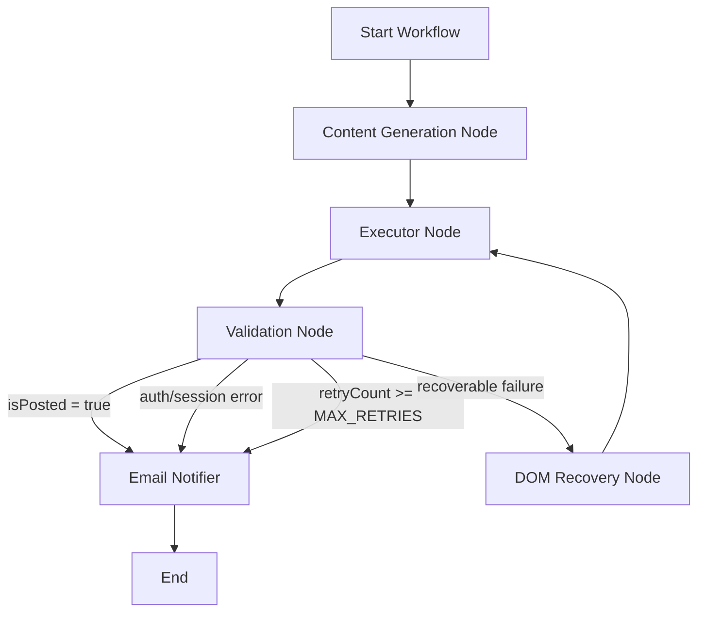

# X Autonomous Post Agent

An open-source autonomous agent that generates a technical post with Gemini, publishes to X.com with Playwright, validates the result, and sends an email report.

Built with:
- Node.js
- Playwright
- LangGraph
- Gemini API (`@google/genai`)
- Nodemailer

## What this project does

1. Generates a post text using Gemini.
2. Opens X.com with an authenticated browser session.
3. Fills the composer and clicks Post.
4. Validates whether the post appears.
5. Sends a success/failure email summary.

## Architecture



## Repository structure

- `agent.js`: main runtime entrypoint.
- `auth.js`: manual login helper to generate `auth-state.json`.
- `src/agent/workflow.js`: LangGraph node orchestration.
- `src/agent/nodes/contentGen.js`: content generation.
- `src/agent/nodes/executor.js`: browser actions on X.com.
- `src/agent/nodes/validetor.js`: post verification.
- `src/agent/nodes/domRecovary.js`: AI fallback for DOM recovery.
- `src/agent/nodes/emailNotifier.js`: email report sender.
- `src/utils/browser.js`: browser/session creation and `X_AUTH_STATE` hydration.
- `.github/workflows/daily-post.yml`: GitHub Actions automation.

## Prerequisites

- Node.js 20+ (project currently runs on Node 24 in GitHub Actions)
- npm
- Gemini API key
- X account
- Gmail account (for email notifications)

## Local setup

1. Install dependencies:

```bash
npm ci
```

2. Create `.env` file:

```env
GEMINI_API_KEY=your_gemini_api_key
EMAIL_USER=your_email@gmail.com
EMAIL_PASS=your_gmail_app_password
NOTIFICATION_RECIPIENT=recipient_email@gmail.com
```

3. Generate authenticated session:

```bash
node auth.js
```

Log in to X in the opened browser window. It will save `auth-state.json`.

4. Run the agent:

```bash
node agent.js
```

## GitHub Actions setup (daily automation)

The workflow file is already configured in `.github/workflows/daily-post.yml`.

Current schedule:
- `30 15 * * *` (UTC) = 9:30 PM Bangladesh time (UTC+6)

### Required GitHub secrets

Set these in Repository Settings -> Secrets and variables -> Actions:

- `GEMINI_API_KEY`
- `X_AUTH_STATE`
- `EMAIL_USER`
- `EMAIL_PASS`
- `NOTIFICATION_RECIPIENT` (optional, defaults to `EMAIL_USER`)

## How to create `X_AUTH_STATE`

`X_AUTH_STATE` must be base64 content of `auth-state.json`.

PowerShell command:

```powershell
$path = Join-Path (Get-Location) 'auth-state.json'
$bytes = [System.IO.File]::ReadAllBytes($path)
[Convert]::ToBase64String($bytes) | Set-Content -NoNewline -Encoding ascii x_auth_state_base64.txt
```

Then copy full content from `x_auth_state_base64.txt` and paste into GitHub secret `X_AUTH_STATE`.

## Run manually from GitHub

1. Open Actions tab in your repo.
2. Select `Daily Autonomous X Post`.
3. Click `Run workflow`.
4. Choose `main` branch.
5. Run.

## Common issues and fixes

### 1) `UNAUTHENTICATED_X_SESSION`

Symptom:
- Redirect from `https://x.com/home` to `https://x.com/`
- Composer is never found.

Cause:
- Session is not accepted on that runner environment.

Fix:
- Regenerate `auth-state.json` with `node auth.js`.
- Rebuild and replace `X_AUTH_STATE` secret.
- If GitHub-hosted runners still fail, use a self-hosted runner or your own VPS/PC scheduler.

### 2) Email not received

- Verify `EMAIL_USER` and `EMAIL_PASS` secrets exist.
- Use Gmail App Password (not normal account password).
- Check spam/junk folder.

### 3) Gemini quota errors (`429 RESOURCE_EXHAUSTED`)

- You hit API quota limits.
- Wait for quota reset or upgrade plan.

## Security notes

- Never commit `.env`, `auth-state.json`, or `x_auth_state_base64.txt`.
- Rotate secrets if exposed.
- Treat `auth-state.json` as sensitive account data.

## Contributing

Contributions are welcome.

1. Fork the repo.
2. Create a feature branch.
3. Make small focused changes.
4. Add/update docs when behavior changes.
5. Open a pull request with clear description and test steps.

## License

ISC (see `package.json`).
